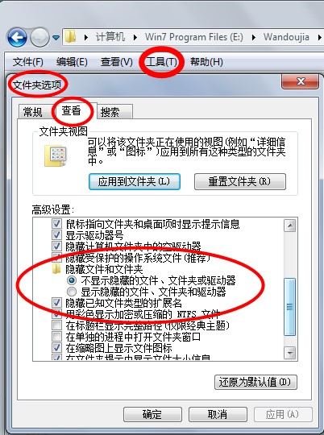

# **AutoRun类病毒防治策略**

----------
第一次接触这种病毒是在高中，当时U盘打开后只有以“.exe”结尾的文件夹，而原有的所有文件夹都被隐藏起来了。要想恢复U盘里的原有文件夹的话，像下图一样“选择工具->文件夹选项->查看”打开windows下的隐藏文件夹和隐藏文件即可。注意，最好的话不要选中底下“隐藏已知文件类型的扩展名”。

后来，高中信息老师告诉我们一种防治这种病毒的方法，那就是打开文件时使用“资源管理器”打开，便可避免这种U盘AutoRun类的感染。当时大多数电脑还是XP的系统，可以右键选择使用资源器管理打开。
不过，最近厦大图书馆的电脑也感染了AutoRun这类病毒，我特意的去网上搜了一下解决办法，发现了不少问题，现在拿出来分享一下。
首先，U盘里面会有一个autorun.inf的文件，它的作用就是当打开U盘时自动运行某个程序。AutoRun类病毒就是利用这个机制来传
播病毒，恶意窃取用户文件信息的。不过到了win7系统，微软发布更新关闭非光盘驱动器的AutoRun，微软制作出图形化接口AutoPlay，让用户方便选择如何处理设备中的文件，也就是win7中的自动播放选项。

简而言之，就是微软已经把针对AutoRun类病毒的防治补丁放在了Microsoft Update中了，Windows 7以上的用户即使在设备中有病毒也不用担心相关问题，除非用户自己手动运行它。
现在网络上大量的AutoRun类病毒处理办法已经过时了。我个人觉得可以采取以下措施防治AutoRun类病毒：
> 1.	养成良好的操作习惯。
U盘不轻易连接未知电脑；
尽量使用U盘的写保护开关连接公共电脑；
尽量选择在左窗口打开文件夹；
关闭U盘的自动播放功能；
重要资料及时备份。
> 2.	如果要防治AutoRun类病毒写入U盘，可在U盘根目录创建名为autorun.inf的文件夹，设置文件夹的属性为只读隐藏。这种方法只能起到部分防治作用，不要过于依赖。
> 3.	其实最简便的就是安装杀毒软件，一键扫描，一键处理了。毕竟现在杀毒软件都不收费了。

2014年11月26日星期三
MarkDown编辑器
